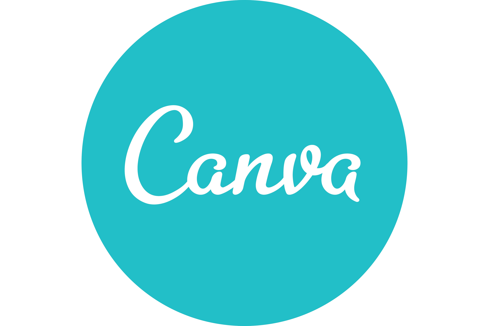

# food puquio

https://www.figma.com/proto/ZarXDCJK862vpi7mf0isl7/comida?node-id=175-622&node-type=canvas&t=gr4gdDyz5AlR8FUo-1&scaling=scale-down&content-scaling=fixed&page-id=18%3A83
Una app de comida puede servir para varios propósitos, que mejoran la experiencia de los usuarios y optimizan el proceso de compra y consumo de alimentos. 
## casos de usos
1. Pedido y Entrega de Comida
- Permite a los usuarios pedir alimentos de restaurantes locales y recibirlos en su hogar o lugar de trabajo.
- Facilita el acceso a una variedad de opciones culinarias sin necesidad de desplazarse.
  
2. Exploración de Menús
- Ofrece la posibilidad de explorar menús de diferentes restaurantes, incluyendo descripciones de platos, precios y fotos.
- Ayuda a los usuarios a tomar decisiones informadas sobre qué comer.
 
3. Promociones y Descuentos
- Muchas apps proporcionan ofertas especiales o descuentos, lo que puede hacer que pedir comida sea más asequible.
- Permiten a los usuarios estar al tanto de las promociones en sus restaurantes favoritos.
 
4. Calificaciones y Reseñas
- Facilitan la evaluación de restaurantes mediante calificaciones y reseñas de otros clientes.
- Ayudan a los usuarios a elegir opciones de calidad basadas en experiencias previas.
 
5. Personalización de Pedidos
- Permiten a los usuarios personalizar sus pedidos, eligiendo ingredientes o especificando preferencias dietéticas.
- Esto mejora la satisfacción del cliente al adaptar la comida a sus gustos.
 
6. Seguimiento de Pedidos
- Ofrecen la opción de seguir el estado del pedido en tiempo real, desde la preparación hasta la entrega.
- Proporcionan tranquilidad a los usuarios al saber cuándo recibirán su comida.
 
7. Opciones de Pago
- Proporcionan varias opciones de pago, como tarjetas de crédito, débito, y pagos móviles, lo que hace el proceso más conveniente.
- A menudo incluyen funciones de pago seguro.
 
8. Interacción Social
- Algunas apps incluyen funciones sociales que permiten a los usuarios compartir sus experiencias o recomendaciones con amigos.
- Fomentan una comunidad en torno a la gastronomía.
 
9. Facilidades para Restaurantes
- También sirven como una plataforma para que los restaurantes gestionen sus pedidos y clientes.
- Ayudan a aumentar la visibilidad y las ventas de los negocios locales.
 
En resumen, una app de comida no solo simplifica el proceso de pedir y recibir alimentos, sino que también mejora la experiencia del usuario al ofrecer múltiples funcionalidades que facilitan la elección, el pago y la interacción.
## Tecnologias de uso para hacer la app
- FIGMA 
  ayuda a los equipos de diseño y desarrollo a crear mejores conjunto de productos
  
- CANVA 
  es un documento fácil de entender que te ayudará a explicar tu negocio implicados a modelo de todos los Canva 
  
- EXCEL EN GOOGLE DRIVE 
  es una plataforma de diseño y comunicación visual
  
- DISCORD 
  Es una plataforma para que personas con intereses similares compartan y se comuniquen 
  
- NOTION 
  Tomar notas, planificar, gestionar, organizar proyectos e información hasta crear tableros de inspiración
  
## Arquitectura
Tu app de comida utiliza la metodología Modelo-Vista-Controlador (MVC) por que optimizan su desarrollo y funcionamiento. 
1. Separación de Responsabilidades
- El patrón MVC permite dividir la aplicación en tres componentes distintos: modelo, vista y controlador. Esto facilita la gestión del código, ya que cada parte tiene una responsabilidad específica.
  
1. Facilita el Mantenimiento
   Con la separación de preocupaciones, es más fácil realizar cambios en una parte de la aplicación sin afectar a las demás. Por ejemplo, puedes actualizar la interfaz de usuario (vista) o modificar la lógica de negocio (modelo) sin tener que reescribir todo el código.
  
1. Escalabilidad
  A medida que tu app crece y se añaden más funcionalidades, el patrón MVC permite integrar nuevas características de manera más sencilla. Puedes agregar nuevas vistas o controladores sin complicar la estructura existente.
 
1. Mejoras en la Pruebas
   La estructura modular del MVC facilita la realización de pruebas unitarias. Puedes probar el modelo y el controlador de manera independiente, lo que mejora la calidad del código y reduce errores.
 
2. Interacción del Usuario
   El controlador actúa como intermediario entre la vista y el modelo, gestionando la lógica de las interacciones del usuario (como pedidos y pagos). Esto permite una experiencia de usuario más fluida y organizada.
 
3. Flexibilidad en la Interfaz
  Puedes cambiar la forma en que se presenta la información al usuario (vista) sin afectar cómo se gestionan los datos (modelo). Esto es especialmente útil en apps de comida, donde la presentación visual es crucial para atraer a los usuarios.
 
1. Colaboración en Equipos
   En equipos de desarrollo, diferentes miembros pueden trabajar en la vista, el modelo o el controlador de manera simultánea, lo que mejora la eficiencia y la colaboración.
 
La metodología MVC es ideal para nuestra app de comida porque proporciona una estructura clara y eficiente, permite realizar cambios y mejoras fácilmente, y mejora la experiencia del usuario. Esto se traduce en una aplicación más robusta y fácil de mantener.
  

## Metodologia de trabajo
LEAN
Las metodologías Lean son enfoques de gestión que se centran en la mejora continua y la eliminación de desperdicios para maximizar el valor para el cliente. A continuación, un resumen de sus principios clave:
 
Principios 
- Valor: Define lo que es valioso desde la perspectiva del cliente. Todo lo que no añade valor se considera desperdicio.
- Flujo: Asegura que los procesos fluyan sin interrupciones, minimizando tiempos de espera y retrasos.
- Tirar en lugar de empujar: La producción se basa en la demanda real del cliente, evitando la sobreproducción.
- Perfección: Se busca la mejora continua mediante la identificación y eliminación constante de desperdicios.
- Empoderamiento del equipo: Los empleados son alentados a contribuir con ideas y mejoras, creando un ambiente de trabajo colaborativo

Beneficios
- Reducción de costos.
- Mejora en la satisfacción del cliente.
- Aumento en la eficiencia operativa.
 
En resumen, Lean es un enfoque sistemático para optimizar procesos y satisfacer al cliente, centrado en la eliminación de desperdicios y la mejora continua.

## LINKS
https://discord.gg/UNtdXNFe